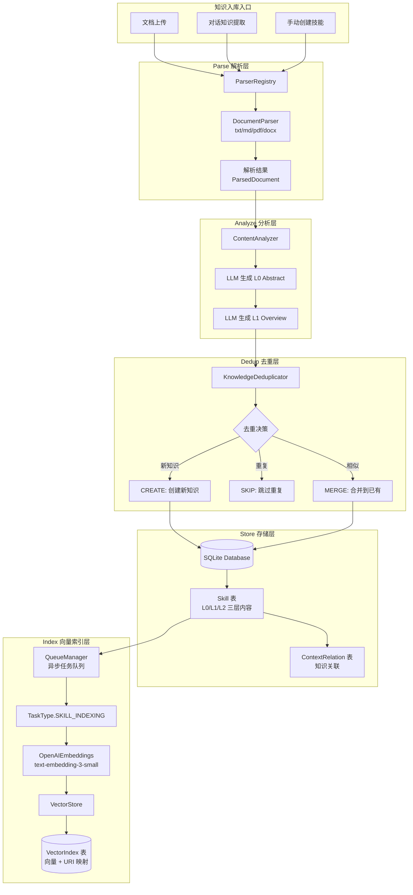
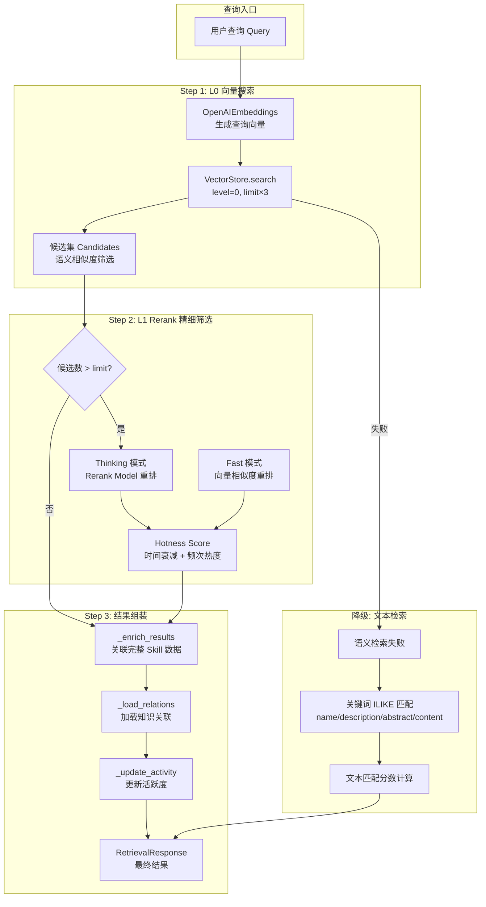
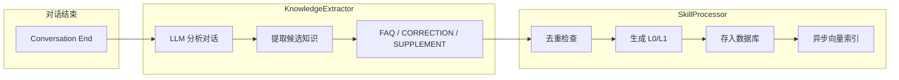

# Skill-Know 知识库系统

以 Skill 搜索为主的知识库系统，支持文档管理、技能管理、智能搜索和 AI 对话。

## 功能特性

- **技能管理**: 系统技能和文档技能的管理，支持分类、搜索和编辑
- **文档管理**: 文档上传、分类、全文搜索
- **知识搜索**: 自然语言搜索和 SQL 搜索
- **智能对话**: 基于 LangChain 的流式 AI 对话
- **提示词管理**: 系统提示词的查看和编辑
- **快速设置**: 最小化配置即可使用

## 核心架构

### 文件夹协议 — 核心设计

> **这是 Skill-Know 的核心设计**，定义了知识的组织、检索和优先级机制。

#### 设计原理

文件夹协议解决三个核心问题：

1. **知识组织**：如何用树形结构组织海量知识？
2. **知识迁移**：如何在不同文件夹间移动知识而不丢失上下文？
3. **检索优先**：如何让某些文件夹的知识优先被检索到？

```
┌─────────────────────────────────────────────────────────────────────────────────────┐
│                        文件夹协议 — 数据库映射关系                                    │
├─────────────────────────────────────────────────────────────────────────────────────┤
│                                                                                     │
│  ┌───────────────────────────────────────────────────────────────────────────────┐ │
│  │  表结构映射                                                                    │ │
│  │                                                                               │ │
│  │    ┌────────────────────┐         ┌────────────────────┐                      │ │
│  │    │  document_folders  │         │       skills       │                      │ │
│  │    │    (文件夹表)       │         │     (技能表)        │                      │ │
│  │    ├────────────────────┤         ├────────────────────┤                      │ │
│  │    │ id: PK             │ ◄───────│ folder_id: FK      │                      │ │
│  │    │ name: str          │         │ id: PK             │                      │ │
│  │    │ description: text  │         │ name: str          │                      │ │
│  │    │ parent_id: FK ─────┼──┐      │ type: enum         │                      │ │
│  │    │ sort_order: int    │  │      │ category: enum     │                      │ │
│  │    │ is_system: bool    │  │      │ priority: int      │                      │ │
│  │    └────────────────────┘  │      │ abstract (L0)      │                      │ │
│  │                            │      │ overview (L1)      │                      │ │
│  │                            │      │ content (L2)       │                      │ │
│  │                            │      └────────────────────┘                      │ │
│  │                            │                                                    │ │
│  │                            │      自引用关系                                   │ │
│  │                            │      (支持无限嵌套)                               │ │
│  │                            ▼                                                    │ │
│  │    ┌────────────────────┐                                                      │ │
│  │    │  document_folders  │                                                      │ │
│  │    │ parent_id ─────────┼────────► id (父文件夹)                               │ │
│  │    └────────────────────┘                                                      │ │
│  │                                                                               │ │
│  └───────────────────────────────────────────────────────────────────────────────┘ │
│                                                                                     │
│  ┌───────────────────────────────────────────────────────────────────────────────┐ │
│  │  关系说明                                                                      │ │
│  │                                                                               │ │
│  │    1. Skill.folder_id ──► DocumentFolder.id                                   │ │
│  │       - 多对一关系：多个技能可以属于同一个文件夹                               │ │
│  │       - 软删除：folder_id 设置 ondelete="SET NULL"                            │ │
│  │       - 删除文件夹时，技能的 folder_id 置空，技能本身不删除                    │ │
│  │                                                                               │ │
│  │    2. DocumentFolder.parent_id ──► DocumentFolder.id                          │ │
│  │       - 自引用关系：文件夹可以嵌套                                            │ │
│  │       - 树形结构：parent_id=NULL 为根目录                                     │ │
│  │       - 级联删除：删除父文件夹时，子文件夹一并删除                             │ │
│  │                                                                               │ │
│  └───────────────────────────────────────────────────────────────────────────────┘ │
│                                                                                     │
└─────────────────────────────────────────────────────────────────────────────────────┘
```

#### 文件夹树形结构与查找

```
┌─────────────────────────────────────────────────────────────────────────────────────┐
│                     文件夹树形结构 — 一层层查找                                       │
├─────────────────────────────────────────────────────────────────────────────────────┤
│                                                                                     │
│  数据库存储 (document_folders 表):                                                   │
│                                                                                     │
│    ┌────────────────────────────────────────────────────────────────────────────┐  │
│    │ id          │ name        │ parent_id │ sort_order │ is_system │           │  │
│    ├─────────────┼─────────────┼───────────┼────────────┼──────────┤           │  │
│    │ folder-000  │ 根目录       │ NULL      │ 0          │ true     │           │  │
│    │ folder-001  │ 技术文档     │ NULL      │ 10         │ false    │           │  │
│    │ folder-002  │ 前端开发     │ folder-001│ 0          │ false    │           │  │
│    │ folder-003  │ 后端开发     │ folder-001│ 1          │ false    │           │  │
│    │ folder-004  │ React        │ folder-002│ 0          │ false    │           │  │
│    │ folder-005  │ Vue          │ folder-002│ 1          │ false    │           │  │
│    │ folder-006  │ FastAPI      │ folder-003│ 0          │ false    │           │  │
│    │ folder-007  │ 产品文档     │ NULL      │ 20         │ false    │           │  │
│    └────────────────────────────────────────────────────────────────────────────┘  │
│                                                                                     │
│  树形结构可视化:                                                                    │
│                                                                                     │
│    ┌─────────────────────────────────────────────────────────────────────────────┐ │
│    │                                                                             │ │
│    │    📁 根目录 (folder-000, parent_id=NULL, is_system=true)                   │ │
│    │        └── 系统文件夹，不可删除                                              │ │
│    │                                                                             │ │
│    │    📁 技术文档 (folder-001, parent_id=NULL, sort_order=10)                   │ │
│    │        │                                                                    │ │
│    │        ├── 📁 前端开发 (folder-002, parent_id=folder-001)                    │ │
│    │        │       │                                                            │ │
│    │        │       ├── 📁 React (folder-004, parent_id=folder-002)               │ │
│    │        │       │     ├── 📄 React Hooks 入门 (skill.folder_id=folder-004)  │ │
│    │        │       │     └── 📄 React Router 指南                               │ │
│    │        │       │                                                            │ │
│    │        │       └── 📁 Vue (folder-005, parent_id=folder-002)                 │ │
│    │        │             └── 📄 Vue 3 组合式 API                                │ │
│    │        │                                                                    │ │
│    │        └── 📁 后端开发 (folder-003, parent_id=folder-001)                    │ │
│    │              │                                                              │ │
│    │              └── 📁 FastAPI (folder-006, parent_id=folder-003)             │ │
│    │                    ├── 📄 FastAPI 依赖注入                                  │ │
│    │                    └── 📄 FastAPI 路由最佳实践                              │ │
│    │                                                                             │ │
│    │    📁 产品文档 (folder-007, parent_id=NULL, sort_order=20)                   │ │
│    │          └── 📄 需求分析模板                                                │ │
│    │                                                                             │ │
│    └─────────────────────────────────────────────────────────────────────────────┘ │
│                                                                                     │
│  一层层查找算法:                                                                    │
│                                                                                     │
│    def get_folder_path(folder_id: str) -> list[DocumentFolder]:                    │
│        """从当前文件夹向上查找，返回完整路径"""                                      │
│        path = []                                                                   │
│        current = get_folder(folder_id)                                             │
│        while current:                                                              │
│            path.insert(0, current)  # 插入到头部，保持从根到叶的顺序                 │
│            current = get_folder(current.parent_id)  # 向上查找父文件夹              │
│        return path                                                                 │
│                                                                                     │
│    示例: get_folder_path("folder-004") → [技术文档, 前端开发, React]               │
│                                                                                     │
└─────────────────────────────────────────────────────────────────────────────────────┘
```

#### 文件夹迁移协议

```
┌─────────────────────────────────────────────────────────────────────────────────────┐
│                        文件夹迁移 — 如何转换文件夹                                   │
├─────────────────────────────────────────────────────────────────────────────────────┤
│                                                                                     │
│  迁移场景:                                                                          │
│                                                                                     │
│    场景1: 移动单个技能到另一个文件夹                                                 │
│    ─────────────────────────────────────────────────────────────────────────────── │
│                                                                                     │
│      ┌──────────────────┐         ┌──────────────────┐                             │
│      │  前端开发         │         │  后端开发         │                             │
│      │  (folder-002)    │         │  (folder-003)    │                             │
│      │                  │         │                  │                             │
│      │  📄 React Hooks  │ ──────► │                  │                             │
│      │  folder_id: 002  │  move   │  📄 React Hooks  │                             │
│      │                  │         │  folder_id: 003  │                             │
│      └──────────────────┘         └──────────────────┘                             │
│                                                                                     │
│      SQL: UPDATE skills SET folder_id = 'folder-003' WHERE id = 'skill-001'        │
│                                                                                     │
│    场景2: 批量迁移文件夹下的所有技能                                                 │
│    ─────────────────────────────────────────────────────────────────────────────── │
│                                                                                     │
│      ┌──────────────────┐         ┌──────────────────┐                             │
│      │  React           │         │  前端框架         │                             │
│      │  (folder-004)    │         │  (folder-008)    │                             │
│      │                  │         │                  │                             │
│      │  📄 Hooks        │         │  📄 Hooks        │                             │
│      │  📄 Router       │ ──────► │  📄 Router       │                             │
│      │  📄 State        │  batch  │  📄 State        │                             │
│      │                  │  move   │                  │                             │
│      └──────────────────┘         └──────────────────┘                             │
│                                                                                     │
│      SQL: UPDATE skills SET folder_id = 'folder-008'                               │
│           WHERE folder_id = 'folder-004'                                          │
│                                                                                     │
│    场景3: 删除文件夹（软删除保护）                                                   │
│    ─────────────────────────────────────────────────────────────────────────────── │
│                                                                                     │
│      删除前:                                                                        │
│      ┌──────────────────┐                                                          │
│      │  临时文件夹       │                                                          │
│      │  (folder-099)    │                                                          │
│      │  📄 临时笔记      │                                                          │
│      │  folder_id: 099  │                                                          │
│      └──────────────────┘                                                          │
│                                                                                     │
│      删除后 (ondelete="SET NULL"):                                                  │
│      ┌──────────────────┐                                                          │
│      │  (文件夹已删除)   │                                                          │
│      │                  │         ┌──────────────────┐                             │
│      │                  │         │  📄 临时笔记      │                             │
│      │                  │         │  folder_id: NULL │  ← 技能保留，文件夹置空      │
│      │                  │         │  (未分类)        │                             │
│      └──────────────────┘         └──────────────────┘                             │
│                                                                                     │
│  迁移规则:                                                                          │
│                                                                                     │
│    ┌─────────────────────────────────────────────────────────────────────────────┐ │
│    │  1. SYSTEM 技能不可迁移 (folder_id 固定为 NULL)                              │ │
│    │  2. DOCUMENT 技能可迁移 (修改 folder_id 即可)                                 │ │
│    │  3. USER 技能可自由迁移 (包括设置为 NULL，变成未分类)                         │ │
│    │  4. 迁移不影响向量索引 (VectorIndex 通过 URI 关联，不受 folder_id 影响)       │ │
│    │  5. 迁移不影响知识关联 (ContextRelation 通过 URI 关联)                        │ │
│    └─────────────────────────────────────────────────────────────────────────────┘ │
│                                                                                     │
└─────────────────────────────────────────────────────────────────────────────────────┘
```

#### 文件夹优先级与加分机制

```
┌─────────────────────────────────────────────────────────────────────────────────────┐
│                     文件夹优先级 — 如何一层层加分                                    │
├─────────────────────────────────────────────────────────────────────────────────────┤
│                                                                                     │
│  优先级来源:                                                                        │
│                                                                                     │
│    ┌─────────────────────────────────────────────────────────────────────────────┐ │
│    │  来源一: DocumentFolder.sort_order (文件夹排序)                              │ │
│    │  ─────────────────────────────────────────────────────────────────────────  │ │
│    │    - 数值越小，优先级越高                                                    │ │
│    │    - 同级文件夹按 sort_order 排序                                            │ │
│    │    - 示例: 技术文档(10) > 产品文档(20)                                       │ │
│    │                                                                             │ │
│    │  来源二: Skill.priority (技能优先级)                                         │ │
│    │  ─────────────────────────────────────────────────────────────────────────  │ │
│    │    - 数值越小，优先级越高                                                    │ │
│    │    - 同一文件夹内按 priority 排序                                            │ │
│    │    - 示例: React Hooks(10) > React Router(20)                               │ │
│    │                                                                             │ │
│    │  来源三: 检索分数 (语义分 + 热度分)                                          │ │
│    │  ─────────────────────────────────────────────────────────────────────────  │ │
│    │    - L0_SCORE × 0.5 + L1_SCORE × 0.5 = SEMANTIC_SCORE                       │ │
│    │    - SEMANTIC_SCORE × 0.8 + HOTNESS_SCORE × 0.2 = FINAL_SCORE               │ │
│    └─────────────────────────────────────────────────────────────────────────────┘ │
│                                                                                     │
│  加分流程:                                                                          │
│                                                                                     │
│    用户查询 "React Hooks"                                                            │
│        │                                                                            │
│        ▼                                                                            │
│    ┌─────────────────────────────────────────────────────────────────────────────┐ │
│    │  Step 1: L0 向量检索 (获取候选集)                                            │ │
│    │                                                                             │ │
│    │    候选结果:                                                                 │ │
│    │    ┌────────────────┬─────────────┬─────────────┬─────────────┐            │ │
│    │    │ 技能           │ L0_SCORE    │ folder_id   │ priority    │            │ │
│    │    ├────────────────┼─────────────┼─────────────┼─────────────┤            │ │
│    │    │ React Hooks    │ 0.85        │ folder-004  │ 10          │            │ │
│    │    │ React Router   │ 0.72        │ folder-004  │ 20          │            │ │
│    │    │ Vue Hooks      │ 0.68        │ folder-005  │ 15          │            │ │
│    │    │ FastAPI Hooks  │ 0.45        │ folder-006  │ 30          │            │ │
│    │    └────────────────┴─────────────┴─────────────┴─────────────┘            │ │
│    └─────────────────────────────────────────────────────────────────────────────┘ │
│        │                                                                            │
│        ▼                                                                            │
│    ┌─────────────────────────────────────────────────────────────────────────────┐ │
│    │  Step 2: L1 Rerank (混合 L0 + L1 分数)                                       │ │
│    │                                                                             │ │
│    │    SEMANTIC_SCORE = L0_SCORE × 0.5 + L1_SCORE × 0.5                         │ │
│    │                                                                             │ │
│    │    ┌────────────────┬─────────────┬─────────────┐                           │ │
│    │    │ 技能           │ L1_SCORE    │ SEMANTIC    │                           │ │
│    │    ├────────────────┼─────────────┼─────────────┤                           │ │
│    │    │ React Hooks    │ 0.90        │ 0.875       │  ← 最相关                 │ │
│    │    │ React Router   │ 0.70        │ 0.710       │                           │ │
│    │    │ Vue Hooks      │ 0.65        │ 0.665       │                           │ │
│    │    │ FastAPI Hooks  │ 0.40        │ 0.425       │                           │ │
│    │    └────────────────┴─────────────┴─────────────┘                           │ │
│    └─────────────────────────────────────────────────────────────────────────────┘ │
│        │                                                                            │
│        ▼                                                                            │
│    ┌─────────────────────────────────────────────────────────────────────────────┐ │
│    │  Step 3: Hotness 加分 (热度分混合)                                           │ │
│    │                                                                             │ │
│    │    FINAL_SCORE = SEMANTIC × 0.8 + HOTNESS × 0.2                             │ │
│    │                                                                             │ │
│    │    ┌────────────────┬────────────┬─────────────┬─────────────┐             │ │
│    │    │ 技能           │ HOTNESS    │ FINAL_SCORE │ 排名        │             │ │
│    │    ├────────────────┼────────────┼─────────────┼─────────────┤             │ │
│    │    │ React Hooks    │ 0.50       │ 0.800       │ 1           │             │ │
│    │    │ React Router   │ 0.30       │ 0.628       │ 2           │             │ │
│    │    │ Vue Hooks      │ 0.20       │ 0.572       │ 3           │             │ │
│    │    │ FastAPI Hooks  │ 0.10       │ 0.370       │ 4           │             │ │
│    │    └────────────────┴────────────┴─────────────┴─────────────┘             │ │
│    └─────────────────────────────────────────────────────────────────────────────┘ │
│        │                                                                            │
│        ▼                                                                            │
│    ┌─────────────────────────────────────────────────────────────────────────────┐ │
│    │  Step 4: 文件夹优先级排序 (可选，用于列表展示)                               │ │
│    │                                                                             │ │
│    │    按 (folder.sort_order, skill.priority) 排序:                             │ │
│    │                                                                             │ │
│    │    ┌────────────────┬───────────────────────┬─────────────┐                │ │
│    │    │ 技能           │ 文件夹路径             │ 综合优先级  │                │ │
│    │    ├────────────────┼───────────────────────┼─────────────┤                │ │
│    │    │ React Hooks    │ 技术文档/前端/React    │ 10-10-10    │                │ │
│    │    │ React Router   │ 技术文档/前端/React    │ 10-10-20    │                │ │
│    │    │ Vue Hooks      │ 技术文档/前端/Vue      │ 10-10-15    │                │ │
│    │    │ FastAPI Hooks  │ 技术文档/后端/FastAPI  │ 10-20-30    │                │ │
│    │    └────────────────┴───────────────────────┴─────────────┘                │ │
│    │                                                                             │ │
│    │    排序规则: 文件夹层级越深，路径上每个节点的 sort_order 都参与比较          │ │
│    └─────────────────────────────────────────────────────────────────────────────┘ │
│                                                                                     │
└─────────────────────────────────────────────────────────────────────────────────────┘
```

> **加分机制总结**：
>
> | 阶段 | 分数来源 | 权重 | 作用 |
> |------|----------|------|------|
> | L0 检索 | 余弦相似度 | 100% | 快速筛选候选集 |
> | L1 Rerank | L0×0.5 + L1×0.5 | 100% | 精细重排 |
> | Hotness 混合 | 语义分×0.8 + 热度分×0.2 | 100% | 最终分数 |
> | 列表展示 | 文件夹路径 + priority | - | UI 排序 |
>
> **关键点**：
> - 检索分数与文件夹优先级**独立计算**
> - 检索时按 FINAL_SCORE 排序，不受文件夹影响
> - 列表展示时可按文件夹层级 + priority 排序
> - 文件夹迁移不影响检索分数，只影响 UI 展示顺序

### 三层内容模型 (L0/L1/L2)

系统采用**分层内容模型**，这是 Skill-Know 的核心设计理念：

| 层级 | 名称 | 大小 | 存储位置 | 检索阶段 | 评分权重 |
|------|------|------|----------|----------|----------|
| **L0** | Abstract (摘要) | ~100 tokens | VectorIndex + Skill.abstract | **第一层**：向量检索 | 语义分 × 0.5 |
| **L1** | Overview (概览) | ~2k tokens | VectorIndex + Skill.overview | **第二层**：Rerank 精排 | L0分 × 0.5 + L1分 × 0.5 |
| **L2** | Detail (完整内容) | 全量 | Skill.content | **第三层**：最终展示 | 不参与评分 |

#### 分层落库流程

```
┌─────────────────────────────────────────────────────────────────────────────────────┐
│                          分层落库 — 三层内容独立存储                                  │
├─────────────────────────────────────────────────────────────────────────────────────┤
│                                                                                     │
│    原始知识内容                                                                      │
│        │                                                                            │
│        ▼                                                                            │
│    ┌─────────────────────────────────────────────────────────────────────────────┐ │
│    │  LLM 分层处理                                                                │ │
│    │                                                                             │ │
│    │    原始内容 ──► LLM ──► L0 Abstract (~100 tokens)                           │ │
│    │                         │                                                  │ │
│    │                         └──► L1 Overview (~2k tokens)                       │ │
│    │                                                                             │ │
│    │    L2 Detail = 原始内容（不经过 LLM，直接存储）                              │ │
│    └─────────────────────────────────────────────────────────────────────────────┘ │
│        │                                                                            │
│        │  三层内容分别落库                                                          │
│        ▼                                                                            │
│    ┌─────────────────────────────────────────────────────────────────────────────┐ │
│    │                                                                             │ │
│    │    ┌──────────────────────────────────────────────────────────────────┐    │ │
│    │    │  SQLite: Skill 表 (三层内容字段)                                   │    │ │
│    │    │                                                                    │    │ │
│    │    │    ┌─────────────────────────────────────────────────────────┐   │    │ │
│    │    │    │  id: "skill-001"                                         │   │    │ │
│    │    │    │  name: "React Hooks 入门"                                │   │    │ │
│    │    │    │  abstract: "React Hooks 是函数组件的状态管理方案..."      │   │    │ │  ← L0 字段
│    │    │    │  overview: "## 功能概述\nReact Hooks 提供..."            │   │    │ │  ← L1 字段
│    │    │    │  content: "完整的长文档内容..."                          │   │    │ │  ← L2 字段
│    │    │    │  uri: "sk://skills/react-hooks-intro"                   │   │    │ │
│    │    │    └─────────────────────────────────────────────────────────┘   │    │ │
│    │    │                                                                    │    │ │
│    │    └──────────────────────────────────────────────────────────────────┘    │ │
│    │                                                                             │ │
│    │    ┌──────────────────────────────────────────────────────────────────┐    │ │
│    │    │  SQLite: VectorIndex 表 (向量索引)                               │    │ │
│    │    │                                                                    │    │ │
│    │    │    ┌─────────────────────────────────────────────────────────┐   │    │ │
│    │    │    │  uri: "sk://skills/react-hooks-intro"                   │   │    │ │
│    │    │    │  level: 0                    ← L0 向量索引               │   │    │ │
│    │    │    │  text: "React Hooks 是函数组件的状态管理方案..."          │   │    │ │
│    │    │    │  vector: [0.123, -0.456, ...]  (1536维)                 │   │    │ │
│    │    │    └─────────────────────────────────────────────────────────┘   │    │ │
│    │    │    ┌─────────────────────────────────────────────────────────┐   │    │ │
│    │    │    │  uri: "sk://skills/react-hooks-intro"                   │   │    │ │
│    │    │    │  level: 1                    ← L1 向量索引 (可选)        │   │    │ │
│    │    │    │  text: "## 功能概述\nReact Hooks 提供..."                │   │    │ │
│    │    │    │  vector: [0.234, -0.567, ...]  (1536维)                 │   │    │ │
│    │    │    └─────────────────────────────────────────────────────────┘   │    │ │
│    │    │                                                                    │    │ │
│    │    └──────────────────────────────────────────────────────────────────┘    │ │
│    │                                                                             │ │
│    └─────────────────────────────────────────────────────────────────────────────┘ │
│                                                                                     │
└─────────────────────────────────────────────────────────────────────────────────────┘
```

> **核心设计思想**：
> - **L0/L1 向量化**：只有摘要和概览会被向量化存入 VectorIndex，保证检索效率
> - **L2 原样存储**：完整内容不向量化，避免大向量带来的存储和计算开销
> - **分层独立索引**：L0 和 L1 各自独立建立向量索引，支持按层级检索

### 知识嵌入流程

```
┌─────────────────────────────────────────────────────────────────────────────────────┐
│                              知识嵌入完整流程                                         │
├─────────────────────────────────────────────────────────────────────────────────────┤
│                                                                                     │
│  ┌──────────────┐     ┌──────────────┐     ┌──────────────┐                         │
│  │  文档上传     │     │ 对话知识提取  │     │ 手动创建技能  │                         │
│  │  (BatchUpload)│     │(KnowledgeExt)│     │  (SkillAPI)  │                         │
│  └──────┬───────┘     └──────┬───────┘     └──────┬───────┘                         │
│         │                    │                    │                                 │
│         └────────────────────┼────────────────────┘                                 │
│                              ▼                                                      │
│  ┌───────────────────────────────────────────────────────────────────────────────┐ │
│  │  Parse 解析层 (ParserRegistry → DocumentParser)                                │ │
│  │  ┌─────────┐  ┌─────────┐  ┌─────────┐  ┌─────────┐                           │ │
│  │  │   txt   │  │   md    │  │   pdf   │  │  docx   │  → ParsedDocument         │ │
│  │  └─────────┘  └─────────┘  └─────────┘  └─────────┘                           │ │
│  └───────────────────────────────────────────────────────────────────────────────┘ │
│                              │                                                      │
│                              ▼                                                      │
│  ┌───────────────────────────────────────────────────────────────────────────────┐ │
│  │  Analyze 分析层 (ContentAnalyzer + LLM)                                        │ │
│  │                                                                               │ │
│  │    原始内容 ──────► LLM ──────► L0 Abstract (~100 tokens)                      │ │
│  │                    │                                                          │ │
│  │                    └────────► L1 Overview (~2k tokens)                        │ │
│  └───────────────────────────────────────────────────────────────────────────────┘ │
│                              │                                                      │
│                              ▼                                                      │
│  ┌───────────────────────────────────────────────────────────────────────────────┐ │
│  │  Dedup 去重层 (KnowledgeDeduplicator)                                          │ │
│  │                                                                               │ │
│  │    ┌─────────────┐                                                            │ │
│  │    │ 向量相似检索  │                                                            │ │
│  │    └──────┬──────┘                                                            │ │
│  │           ▼                                                                   │ │
│  │    ┌─────────────────────────────────────────────────────────┐                │ │
│  │    │                    LLM 去重决策                         │                │ │
│  │    │  ┌────────┐    ┌────────┐    ┌────────┐                │                │ │
│  │    │  │ CREATE │    │  SKIP  │    │ MERGE  │                │                │ │
│  │    │  │ 创建新 │    │ 跳过重复│    │合并到已有│                │                │ │
│  │    │  └───┬────┘    └────────┘    └───┬────┘                │                │ │
│  │    └──────┼─────────────────────────────┼────────────────────┘                │ │
│  │           ▼                           ▼                                     │ │
│  └───────────┼─────────────────────────────┼─────────────────────────────────────┘ │
│              │                           │                                        │
│              ▼                           ▼                                        │
│  ┌───────────────────────────────────────────────────────────────────────────────┐ │
│  │  Store 存储层 (SQLite + SQLAlchemy)                                            │ │
│  │                                                                               │ │
│  │    ┌──────────────────┐        ┌──────────────────┐                            │ │
│  │    │    Skill 表       │        │ ContextRelation  │                            │ │
│  │    │  ┌────────────┐  │        │    知识关联表      │                            │ │
│  │    │  │ L0 abstract│  │        └──────────────────┘                            │ │
│  │    │  │ L1 overview│  │                                                        │ │
│  │    │  │ L2 content │  │                                                        │ │
│  │    │  └────────────┘  │                                                        │ │
│  │    └──────────────────┘                                                        │ │
│  └───────────────────────────────────────────────────────────────────────────────┘ │
│                              │                                                      │
│                              ▼                                                      │
│  ┌───────────────────────────────────────────────────────────────────────────────┐ │
│  │  Index 向量索引层 (异步队列)                                                    │ │
│  │                                                                               │ │
│  │    Skill ──► QueueManager ──► SKILL_INDEXING Task ──► 异步执行                 │ │
│  │                                                                   │           │ │
│  │                                                                   ▼           │ │
│  │    ┌─────────────────────────────────────────────────────────────────────┐   │ │
│  │    │  OpenAIEmbeddings (text-embedding-3-small)                          │   │ │
│  │    │                                                                      │   │ │
│  │    │    L0 Abstract ───► 向量化 ───► VectorIndex 表                       │   │ │
│  │    │    L1 Overview ───► 向量化 ───► VectorIndex 表 (可选)                │   │ │
│  │    └─────────────────────────────────────────────────────────────────────┘   │ │
│  └───────────────────────────────────────────────────────────────────────────────┘ │
│                                                                                     │
└─────────────────────────────────────────────────────────────────────────────────────┘
```

<details>
<summary>📊 Mermaid 流程图（点击展开）</summary>



</details>

### 知识搜索流程 — 分层检索与评分

```
┌─────────────────────────────────────────────────────────────────────────────────────┐
│                     分层检索 — 一层一层找，一层一层加分                               │
├─────────────────────────────────────────────────────────────────────────────────────┤
│                                                                                     │
│                              ┌──────────────┐                                       │
│                              │  用户查询 Q   │                                       │
│                              └──────┬───────┘                                       │
│                                     │                                               │
│                                     ▼                                               │
│  ═══════════════════════════════════════════════════════════════════════════════════│
│  第一层: L0 向量检索 (VectorIndex.level=0)                                          │
│  ═══════════════════════════════════════════════════════════════════════════════════│
│                                                                                     │
│    Query ──► OpenAIEmbeddings ──► 查询向量 (1536维)                                  │
│                                     │                                               │
│                                     ▼                                               │
│    ┌─────────────────────────────────────────────────────────────────────────────┐ │
│    │  VectorStore.search(level=0, limit=limit×3)                                 │ │
│    │                                                                             │ │
│    │    ┌───────────────────────────────────────────────────────────────────┐   │ │
│    │    │  查询向量 vs VectorIndex.level=0 向量                               │   │ │
│    │    │                                                                     │   │ │
│    │    │    余弦相似度 = cosine_similarity(query_vec, l0_vec)              │   │ │
│    │    │                                                                     │   │ │
│    │    │    L0_SCORE = 余弦相似度值 (0.0 ~ 1.0)                              │   │ │
│    │    │                                                                     │   │ │
│    │    │    返回: [{uri, L0_SCORE, text, active_count, updated_at}, ...]    │   │ │
│    │    └───────────────────────────────────────────────────────────────────┘   │ │
│    └─────────────────────────────────────────────────────────────────────────────┘ │
│                                     │                                               │
│                                     │  候选集 Candidates (limit×3 条)               │
│                                     ▼                                               │
│  ═══════════════════════════════════════════════════════════════════════════════════│
│  第二层: L1 Rerank 精排 (VectorIndex.level=1)                                       │
│  ═══════════════════════════════════════════════════════════════════════════════════│
│                                                                                     │
│    ┌─────────────────────────────────────────────────────────────────────────────┐ │
│    │                      候选数 > limit ?                                       │ │
│    │                                                                             │ │
│    │         是 (需要精排)                    否 (跳过精排)                      │ │
│    │              │                              │                               │ │
│    │              ▼                              ▼                               │ │
│    │    ┌───────────────────────┐         直接取前 limit 条                       │ │
│    │    │  L1 向量相似度计算     │                                                 │ │
│    │    │                       │                                                 │ │
│    │    │  L1_SCORE = cosine_sim│                                                 │ │
│    │    │    (query_vec, l1_vec)│                                                 │ │
│    │    │                       │                                                 │ │
│    │    │  ┌─────────────────┐  │                                                 │ │
│    │    │  │ 分数混合公式     │  │                                                 │ │
│    │    │  │                 │  │                                                 │ │
│    │    │  │ SEMANTIC_SCORE  │  │                                                 │ │
│    │    │  │ = L0_SCORE × 0.5│  │                                                 │ │
│    │    │  │ + L1_SCORE × 0.5│  │                                                 │ │
│    │    │  └─────────────────┘  │                                                 │ │
│    │    └───────────────────────┘                                                 │ │
│    │                                                                             │ │
│    └─────────────────────────────────────────────────────────────────────────────┘ │
│                                     │                                               │
│                                     │  精排后的候选集                                │
│                                     ▼                                               │
│  ═══════════════════════════════════════════════════════════════════════════════════│
│  第三层: Hotness Score 热度加分 (时间衰减 + 频次热度)                                │
│  ═══════════════════════════════════════════════════════════════════════════════════│
│                                                                                     │
│    ┌─────────────────────────────────────────────────────────────────────────────┐ │
│    │  Hotness Score 计算公式                                                     │ │
│    │                                                                             │ │
│    │    ┌───────────────────────────────────────────────────────────────────┐   │ │
│    │    │  hotness = sigmoid(log1p(active_count)) × time_decay(updated_at)  │   │ │
│    │    │                                                                     │   │ │
│    │    │  - sigmoid: 将访问频次映射到 (0, 1)                                │   │ │
│    │    │  - time_decay: 指数衰减，半衰期 7 天                               │   │ │
│    │    │  - 越常访问、越近更新的知识，热度分越高                            │   │ │
│    │    └───────────────────────────────────────────────────────────────────┘   │ │
│    │                                                                             │ │
│    │  ┌───────────────────────────────────────────────────────────────────┐   │ │
│    │    │  最终分数混合公式 (alpha=0.2)                                     │   │ │
│    │    │                                                                     │   │ │
│    │    │  FINAL_SCORE = SEMANTIC_SCORE × 0.8  ← 语义分 (L0+L1)             │   │ │
│    │    │              + HOTNESS_SCORE × 0.2  ← 热度分                       │   │ │
│    │    │                                                                     │   │ │
│    │    │  高频使用、最近更新的知识会获得额外加分                            │   │ │
│    │    └───────────────────────────────────────────────────────────────────┘   │ │
│    └─────────────────────────────────────────────────────────────────────────────┘ │
│                                     │                                               │
│                                     │  按 FINAL_SCORE 排序                          │
│                                     ▼                                               │
│  ═══════════════════════════════════════════════════════════════════════════════════│
│  第四层: 结果组装 (L2 完整内容加载)                                                  │
│  ═══════════════════════════════════════════════════════════════════════════════════│
│                                                                                     │
│    候选结果 ──► 关联 Skill 表获取 L2 完整内容 ──► 加载知识关联 (relations)            │
│                                     │                                               │
│                                     ▼                                               │
│    ┌─────────────────────────────────────────────────────────────────────────────┐ │
│    │  RetrievalResult:                                                            │ │
│    │    uri, skill_id, name, description, category                                │ │
│    │    abstract (L0), overview (L1), content (L2)  ← 三层内容全部返回            │ │
│    │    score: FINAL_SCORE, matched_by: "semantic"                               │ │
│    │    relations: [{target_uri, relation_type}, ...]                             │ │
│    └─────────────────────────────────────────────────────────────────────────────┘ │
│                                     │                                               │
│                                     ▼                                               │
│    更新活跃度 (active_count + 1) ──► 返回 RetrievalResponse                         │
│                                                                                     │
│  ═══════════════════════════════════════════════════════════════════════════════════│
│  降级方案: 文本检索 (当语义检索失败时)                                              │
│  ═══════════════════════════════════════════════════════════════════════════════════│
│                                                                                     │
│    Query ──► ILIKE 关键词匹配 ──► name / abstract / overview / content              │
│                                     │                                               │
│                                     ▼                                               │
│                           文本匹配分数 (无 L0/L1 分层)                              │
│                    (name:0.5 + abstract:0.3 + overview:0.15 + content:0.05)         │
│                                                                                     │
└─────────────────────────────────────────────────────────────────────────────────────┘
```

> **分层检索核心要点**：
>
> 1. **L0 先筛选**：用摘要向量快速检索，获取候选集（limit×3），计算 L0_SCORE
> 2. **L1 再精排**：对候选集用概览向量重排，混合 L0+L1 分数得到 SEMANTIC_SCORE
> 3. **热度加分**：访问频次 + 时间衰减计算 HOTNESS_SCORE，与语义分混合得 FINAL_SCORE
> 4. **L2 最后加载**：排序完成后，才从 Skill 表加载完整内容返回给用户
>
> **为什么这样设计？**
> - L0 摘要短小，向量检索速度快，适合做大范围筛选
> - L1 概览适中，向量相似度更精准，适合做精细重排
> - L2 内容完整，不参与检索，避免大向量开销，只在最后按需加载
> - 热度机制让常用知识排在前面，符合实际使用场景

<details>
<summary>📊 Mermaid 流程图（点击展开）</summary>



</details>

### 对话知识提取流程

```
┌─────────────────────────────────────────────────────────────────────────────────────┐
│                           对话知识提取完整流程                                        │
├─────────────────────────────────────────────────────────────────────────────────────┤
│                                                                                     │
│   ┌──────────────┐                                                                  │
│   │  对话结束     │                                                                  │
│   │ Conversation │                                                                  │
│   │    End       │                                                                  │
│   └──────┬───────┘                                                                  │
│          │                                                                          │
│          ▼                                                                          │
│   ┌──────────────────────────────────────────────────────────────────────────────┐ │
│   │  KnowledgeExtractor (知识提取器)                                              │ │
│   │                                                                              │ │
│   │    对话消息 ──► LLM 分析 ──► 提取候选知识                                       │ │
│   │                              │                                               │ │
│   │                              ▼                                               │ │
│   │    ┌────────────────────────────────────────────────────────────────────┐   │ │
│   │    │                    知识分类判断                                     │   │ │
│   │    │                                                                    │   │ │
│   │    │  ┌────────────┐  ┌────────────┐  ┌────────────┐                  │   │ │
│   │    │  │    FAQ     │  │ CORRECTION │  │ SUPPLEMENT │                  │   │ │
│   │    │  │ 有价值的   │  │ 用户纠正   │  │ 用户补充   │                  │   │ │
│   │    │  │ 问答对     │  │ AI错误     │  │ 专业知识   │                  │   │ │
│   │    │  └────────────┘  └────────────┘  └────────────┘                  │   │ │
│   │    │                                                                    │   │ │
│   │    │  返回: CandidateKnowledge {title, abstract, content, keywords}   │   │ │
│   │    └────────────────────────────────────────────────────────────────────┘   │ │
│   └──────────────────────────────────────────────────────────────────────────────┘ │
│          │                                                                          │
│          ▼                                                                          │
│   ┌──────────────────────────────────────────────────────────────────────────────┐ │
│   │  SkillProcessor (技能处理管线)                                                 │ │
│   │                                                                              │ │
│   │    候选知识 ──► 去重检查 ──► 生成 L0/L1 ──► 存入数据库 ──► 异步向量索引       │ │
│   │                              │                                               │ │
│   │                              ▼                                               │ │
│   │                    ┌─────────────────┐                                      │ │
│   │                    │ KnowledgeDedup  │                                      │ │
│   │                    │   去重决策       │                                      │ │
│   │                    └─────────────────┘                                      │ │
│   └──────────────────────────────────────────────────────────────────────────────┘ │
│          │                                                                          │
│          ▼                                                                          │
│   ┌──────────────┐                                                                  │
│   │  新知识入库   │                                                                  │
│   │  Skill 表    │                                                                  │
│   │  VectorIndex │                                                                  │
│   └──────────────┘                                                                  │
│                                                                                     │
└─────────────────────────────────────────────────────────────────────────────────────┘
```

<details>
<summary>📊 Mermaid 流程图（点击展开）</summary>



</details>

### 核心组件说明

| 组件 | 文件路径 | 职责 |
|------|----------|------|
| **SkillProcessor** | `backend/app/services/skill_processor.py` | 技能处理管线：Parse → Analyze → Dedup → Store → Index |
| **SkillRetriever** | `backend/app/services/retriever.py` | 分层检索器：L0 向量搜索 → L1 Rerank → 结果组装 |
| **VectorStore** | `backend/app/core/vector_store.py` | 向量存储管理：嵌入生成、索引、检索 |
| **QueueManager** | `backend/app/core/queue.py` | 异步任务队列：EMBEDDING、SKILL_INDEXING |
| **SkillKnowService** | `backend/app/core/service.py` | 聚合服务：统一管理所有子服务生命周期 |
| **Context** | `backend/app/core/context.py` | 统一上下文模型：URI + L0/L1/L2 三层内容 |
| **KnowledgeExtractor** | `backend/app/services/knowledge_extractor.py` | 对话知识提取：从对话中提取有价值知识点 |

### URI 标识体系

```
sk://skills/{name}      — 技能
sk://documents/{id}     — 文档
sk://knowledge/{id}     — 知识条目
```

## 技术栈

### 后端
- Python 3.13+
- FastAPI + Uvicorn
- SQLAlchemy + SQLite (aiosqlite) / PostgreSQL
- LangChain + LangGraph + OpenAI
- Qdrant (向量数据库，可选)
- StructLog (日志)

### 前端
- Next.js 16
- React 19
- TailwindCSS 4
- Radix UI
- Tiptap (富文本编辑器)
- Zustand (状态管理)
- Motion (动画)

## 快速开始

### 1. 启动后端

```bash
cd backend

# 使用 uv 安装依赖（推荐）
uv sync

# 或使用 pip
pip install -e .

# 配置环境变量
cp .env.example .env
# 编辑 .env 填入 LLM_API_KEY

# 启动服务
uv run python -m app.main
```

后端服务运行在 http://localhost:8000

### 2. 启动前端

```bash
cd frontend

# 使用 pnpm 安装依赖（推荐）
pnpm install

# 或使用 npm
npm install

# 启动开发服务器
pnpm dev
```

前端服务运行在 http://localhost:3000

### 3. 首次使用

访问 http://localhost:3000，系统会自动跳转到快速设置页面。
填入 LLM API Key 并测试连接后即可开始使用。

## 项目结构

```
Skill-Know/
├── backend/
│   ├── app/
│   │   ├── core/          # 核心模块（配置、数据库、日志、向量存储）
│   │   │   ├── vector_backends/  # 向量存储后端适配层
│   │   │   └── chat_models/      # 聊天模型配置
│   │   ├── models/        # SQLAlchemy 数据模型
│   │   ├── schemas/       # Pydantic schemas
│   │   ├── services/      # 业务逻辑层
│   │   │   ├── agent/      # AI Agent 工具
│   │   │   ├── skill_search/  # 技能搜索
│   │   │   └── streaming/  # 流式响应
│   │   ├── routers/       # API 路由
│   │   ├── parse/         # 文档解析器注册表
│   │   │   └── parsers/   # txt/md/pdf/docx 解析器
│   │   ├── prompts/       # 系统提示词模板
│   │   └── main.py        # 应用入口
│   ├── packages/          # 本地包
│   │   └── langgraph-agent-kit/  # Agent 开发工具包
│   ├── tests/             # 测试用例
│   └── pyproject.toml
├── frontend/
│   ├── app/               # Next.js App Router
│   ├── components/        # React 组件
│   │   ├── ui/            # 基础 UI 组件 (shadcn/ui)
│   │   └── ...            # 业务组件
│   ├── lib/               # 工具函数和 API 客户端
│   ├── packages/         # 本地包
│   │   ├── embed/        # 嵌入式聊天组件
│   │   └── chat-sdk/     # Chat SDK
│   └── package.json
├── docs/                  # 文档
└── README.md
```

## API 端点

### 技能管理
- `GET /api/skills` - 技能列表
- `POST /api/skills` - 创建技能
- `PUT /api/skills/{id}` - 更新技能
- `DELETE /api/skills/{id}` - 删除技能

### 文档管理
- `GET /api/documents` - 文档列表
- `POST /api/documents/upload` - 上传文档（支持批量）
- `GET /api/documents/{id}` - 获取文档详情
- `DELETE /api/documents/{id}` - 删除文档

### 搜索
- `GET /api/search` - 统一搜索（语义检索 + 文本降级）
- `GET /api/search/sql` - SQL 搜索（高级查询）

### 对话
- `POST /api/chat/stream` - 流式聊天
- `GET /api/conversations` - 对话列表
- `DELETE /api/conversations/{id}` - 删除对话

### 系统配置
- `GET /api/quick-setup/state` - 快速设置状态
- `POST /api/quick-setup/test-connection` - 测试 LLM 连接
- `GET /api/prompts` - 提示词列表
- `PUT /api/prompts/{id}` - 更新提示词

### 其他
- `GET /api/health` - 健康检查
- `POST /api/pack` - 打包导出技能

## 致谢

本项目核心架构设计灵感来源于 [OpenViking](https://github.com/volcengine/OpenViking) 开源项目。

OpenViking 是一个专为 AI Agent 设计的开源上下文数据库，其创新性的设计理念深深影响了 Skill-Know 的架构：

- **文件系统管理范式**：将上下文统一管理为虚拟文件系统，通过 URI 精确定位
- **分层上下文加载 (L0/L1/L2)**：自动将内容处理为三层结构，大幅降低 Token 消耗
- **目录递归检索**：层级式检索提升召回效果

特别感谢 OpenViking 团队的杰出工作和开源贡献，让 AI Agent 的上下文管理变得更加优雅和高效。

> **OpenViking** — The Context Database for AI Agents
> 
> GitHub: https://github.com/volcengine/OpenViking

## 许可证

MIT
