# Skill-Know 技术架构文档

> 基于 OpenViking 记忆系统的设计理念，Skill-Know 实现了一套完整的知识库管理系统。
> 本文档描述系统的核心技术流程、数据流向和关键模块。

---

## 目录

1. [系统总览](#1-系统总览)
2. [核心基础设施](#2-核心基础设施)
3. [知识入库流程](#3-知识入库流程)
4. [知识检索流程](#4-知识检索流程)
5. [对话与 Agent 流程](#5-对话与-agent-流程)
6. [知识生命周期管理](#6-知识生命周期管理)
7. [前端界面](#7-前端界面)
8. [数据模型](#8-数据模型)
9. [配置体系](#9-配置体系)

---

## 1. 系统总览

### 1.1 架构概览

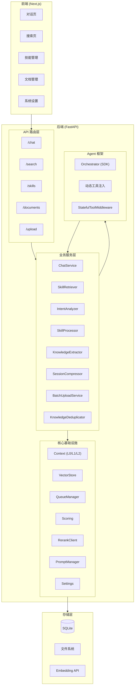

### 1.2 项目目录结构

```
Skill-Know/
├── backend/
│   ├── app/
│   │   ├── core/               # 核心基础设施
│   │   │   ├── config.py           # Pydantic 配置
│   │   │   ├── context.py          # Context + URI + L0/L1/L2
│   │   │   ├── vector_store.py     # 向量存储
│   │   │   ├── vector_backends/    # 向量 DB 适配层
│   │   │   ├── queue.py            # 异步任务队列
│   │   │   ├── scoring.py          # 热度评分
│   │   │   ├── rerank.py           # Rerank 客户端
│   │   │   ├── service.py          # 全局服务单例
│   │   │   └── database.py         # 数据库连接
│   │   ├── models/             # SQLAlchemy 数据模型
│   │   ├── routers/            # FastAPI 路由
│   │   ├── schemas/            # Pydantic 请求/响应
│   │   ├── services/           # 业务逻辑
│   │   │   ├── chat.py             # 对话服务
│   │   │   ├── retriever.py        # 分层检索器
│   │   │   ├── intent_analyzer.py  # 意图分析
│   │   │   ├── skill_processor.py  # 技能处理管线
│   │   │   ├── knowledge_extractor.py    # 知识提取
│   │   │   ├── knowledge_deduplicator.py # 知识去重
│   │   │   ├── session_compressor.py     # 会话压缩
│   │   │   ├── batch_upload.py     # 批量上传
│   │   │   └── agent/              # Agent 工具和中间件
│   │   ├── prompts/            # Prompt 模板系统
│   │   │   ├── manager.py         # PromptManager
│   │   │   └── templates/         # YAML 模板
│   │   └── parse/              # 文档解析器
│   └── packages/
│       └── langgraph-agent-kit/   # 内部 Agent SDK
├── frontend/
│   ├── app/admin/              # 管理页面
│   ├── components/             # UI 组件
│   ├── lib/
│   │   ├── api/                # API 请求
│   │   └── stores/             # Zustand 状态管理
│   └── packages/
│       └── chat-sdk/           # 聊天 SDK
└── docs/
```

### 1.3 启动流程

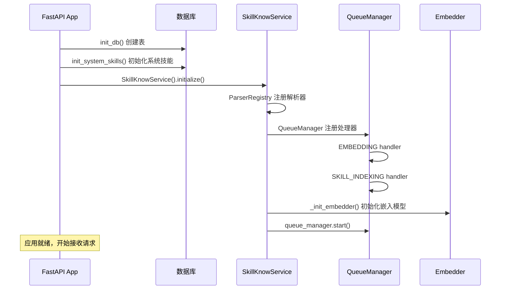

---

## 2. 核心基础设施

### 2.1 Context 模型 — 三层知识表示

Skill-Know 借鉴 OpenViking 的三层内容模型，将每条知识拆分为三个层级：

| 层级 | 名称 | 大小 | 用途 |
|------|------|------|------|
| **L0** | Abstract (摘要) | ~100 tokens | 快速向量检索候选 |
| **L1** | Overview (概览) | ~2k tokens | Rerank 精细筛选、预览 |
| **L2** | Detail (完整内容) | 不限 | 完整知识内容交付 |

**URI 命名规范**：

```
sk://skills/{skill_name}       → 技能知识
sk://documents/{document_id}   → 原始文档
sk://knowledge/{id}            → 提取的知识点
```

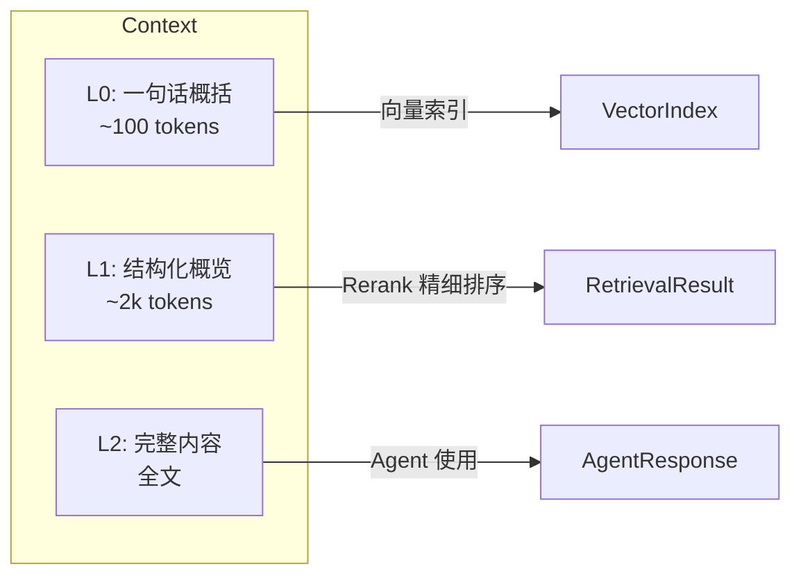

### 2.2 VectorStore — 向量存储与检索

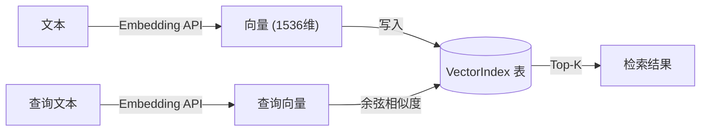

**关键方法**：

- `index_context(context, level)` — 生成嵌入并写入索引
- `search(query, context_type, level, limit)` — 全量扫描 + 余弦相似度
- `update_activity(uri)` — 更新检索命中计数
- `get_stale_entries(days=90)` — 获取长期未使用的条目

**向量 DB 适配层**（`vector_backends/`）：

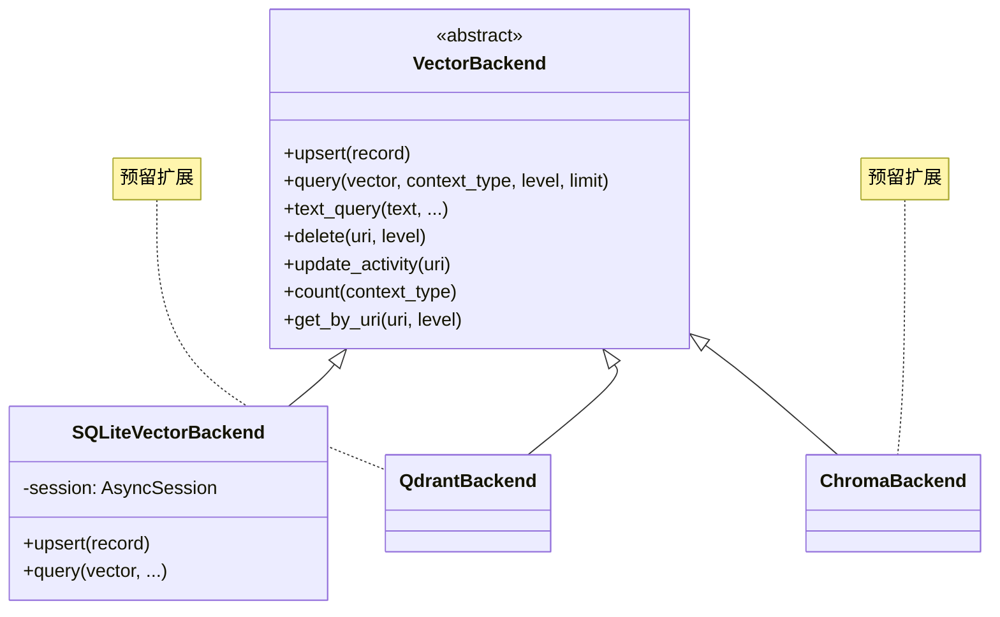

### 2.3 QueueManager — 异步任务队列

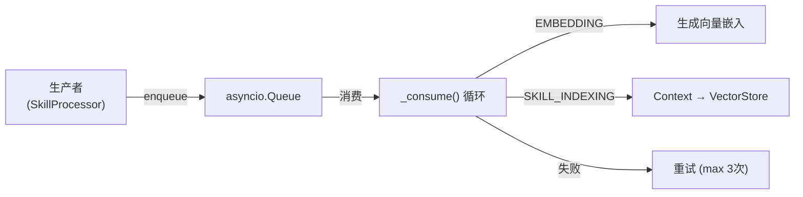

### 2.4 Scoring — 热度评分

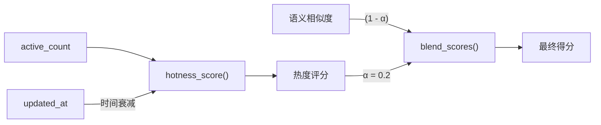

**公式**：
- `hotness = sigmoid(log1p(active_count)) × time_decay`
- `time_decay = 0.5 ^ (days_since_update / half_life)`
- `final_score = (1 - α) × semantic_score + α × hotness_score`

### 2.5 Prompt 模板系统

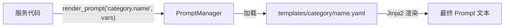

**已有模板**：

| 模板 ID | 用途 |
|---------|------|
| `retrieval.intent_analysis` | 意图分析与查询拆解 |
| `compression.knowledge_extraction` | 对话知识提取 |
| `compression.dedup_decision` | 去重决策 |
| `compression.session_summary` | 会话摘要 |
| `semantic.abstract_generation` | L0 摘要生成 |
| `semantic.overview_generation` | L1 概览生成 |

---

## 3. 知识入库流程

### 3.1 批量上传全流程

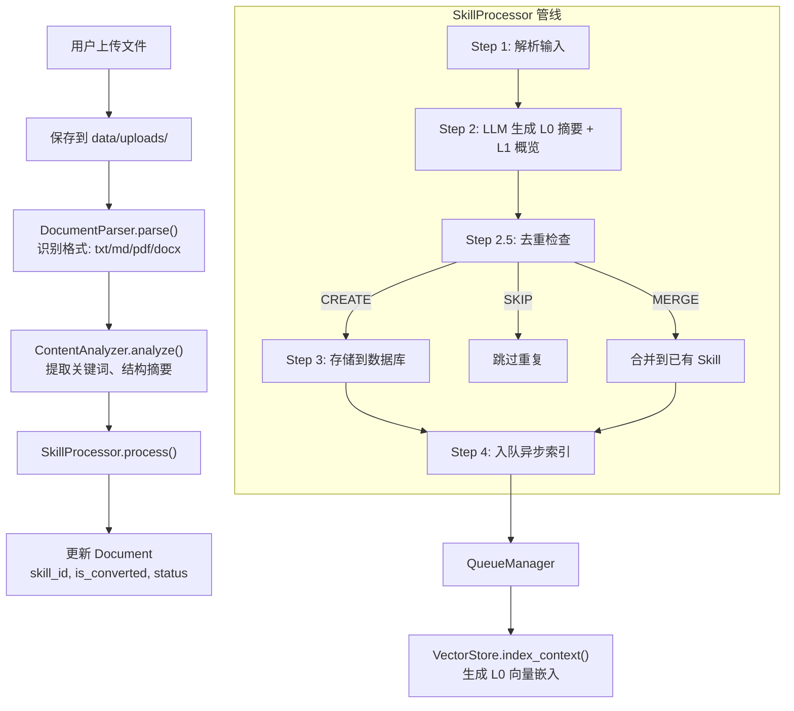

### 3.2 去重决策流程

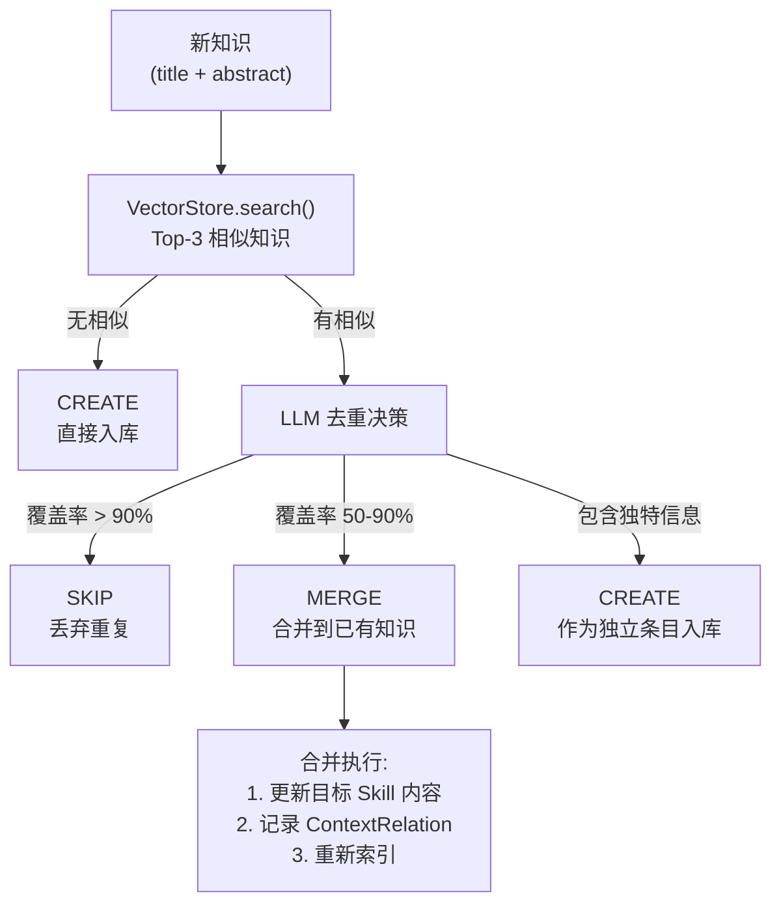

### 3.3 文档转技能流程

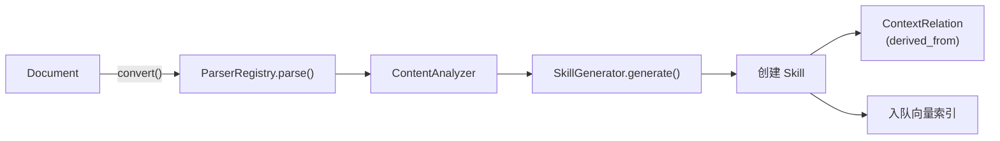

---

## 4. 知识检索流程

### 4.1 分层检索全流程

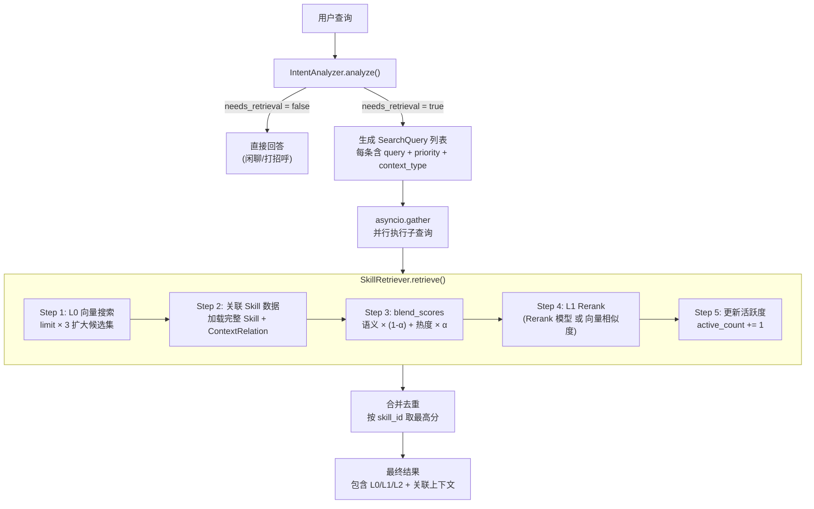

### 4.2 意图分析详细流程

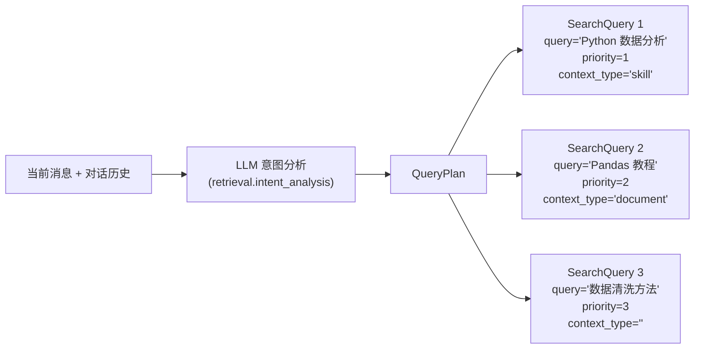

### 4.3 Rerank 两种模式

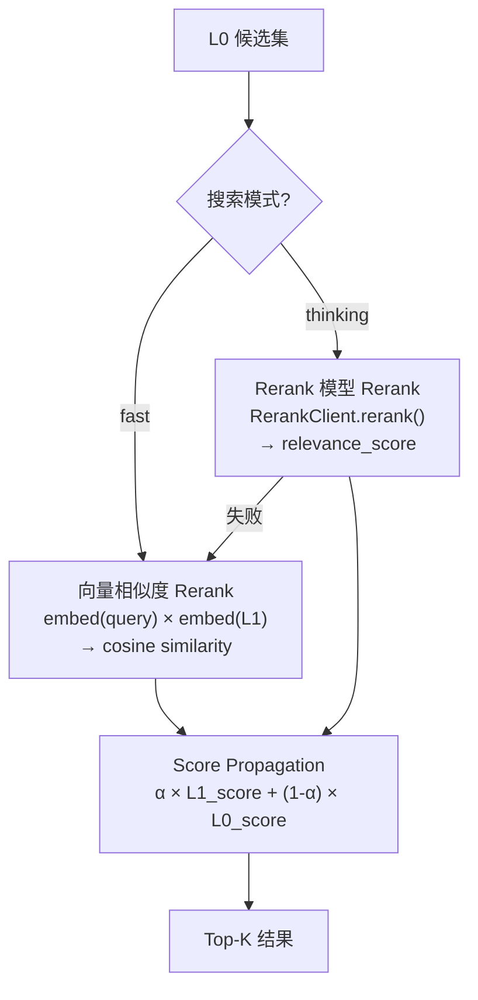

### 4.4 搜索 API 流程

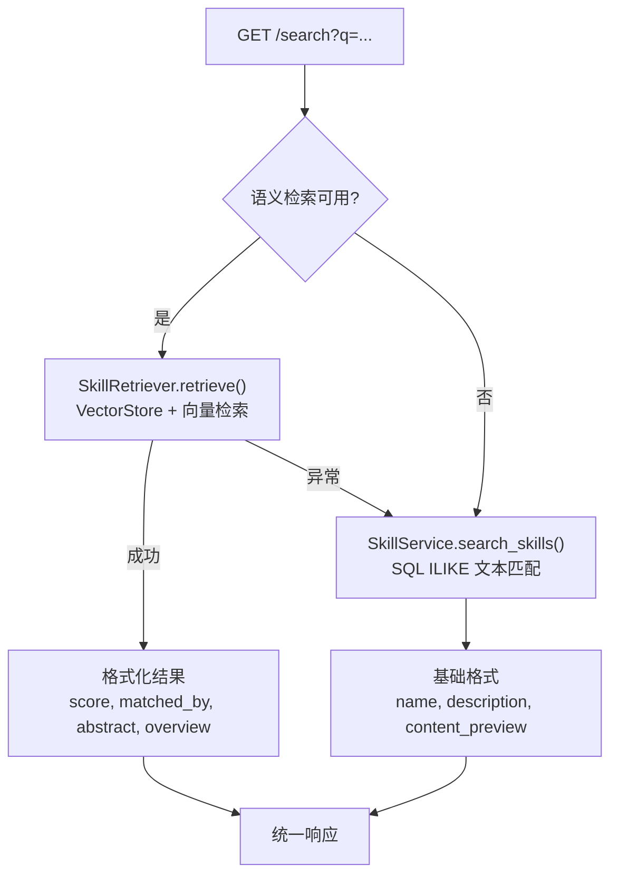

---

## 5. 对话与 Agent 流程

### 5.1 对话全流程

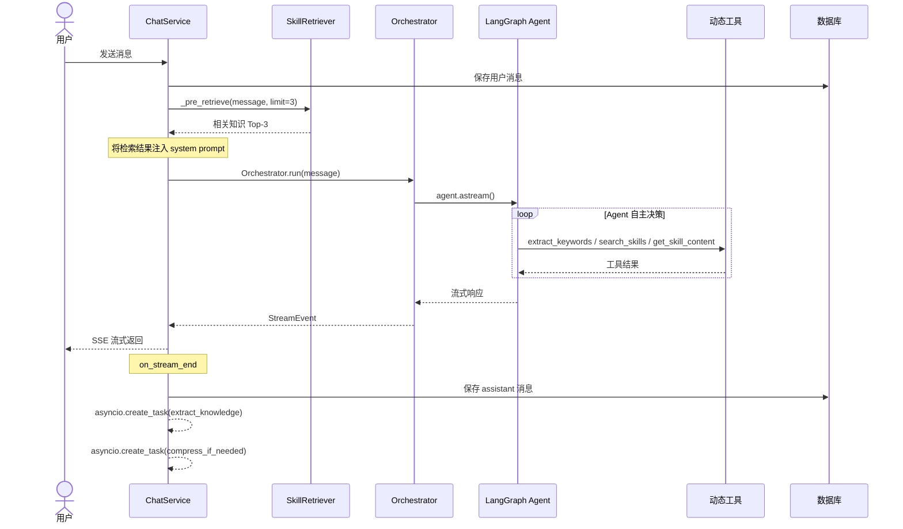

### 5.2 Agent 工具注入与阶段转换

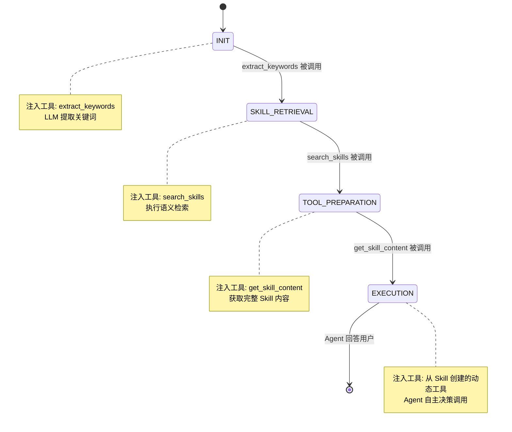

### 5.3 预检索 RAG 注入

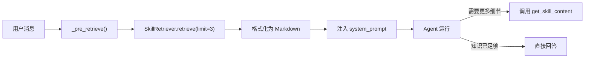

---

## 6. 知识生命周期管理

### 6.1 对话知识提取

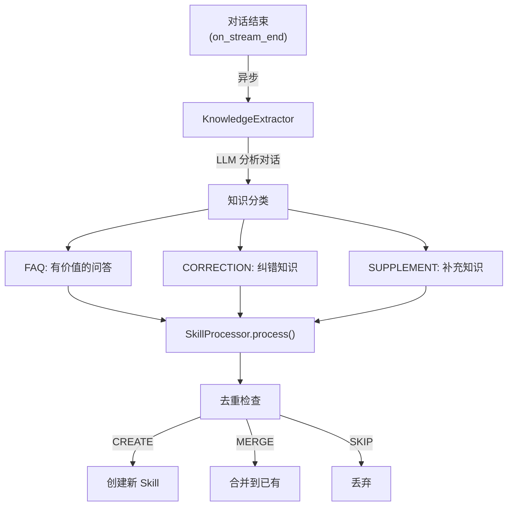

### 6.2 会话压缩与归档

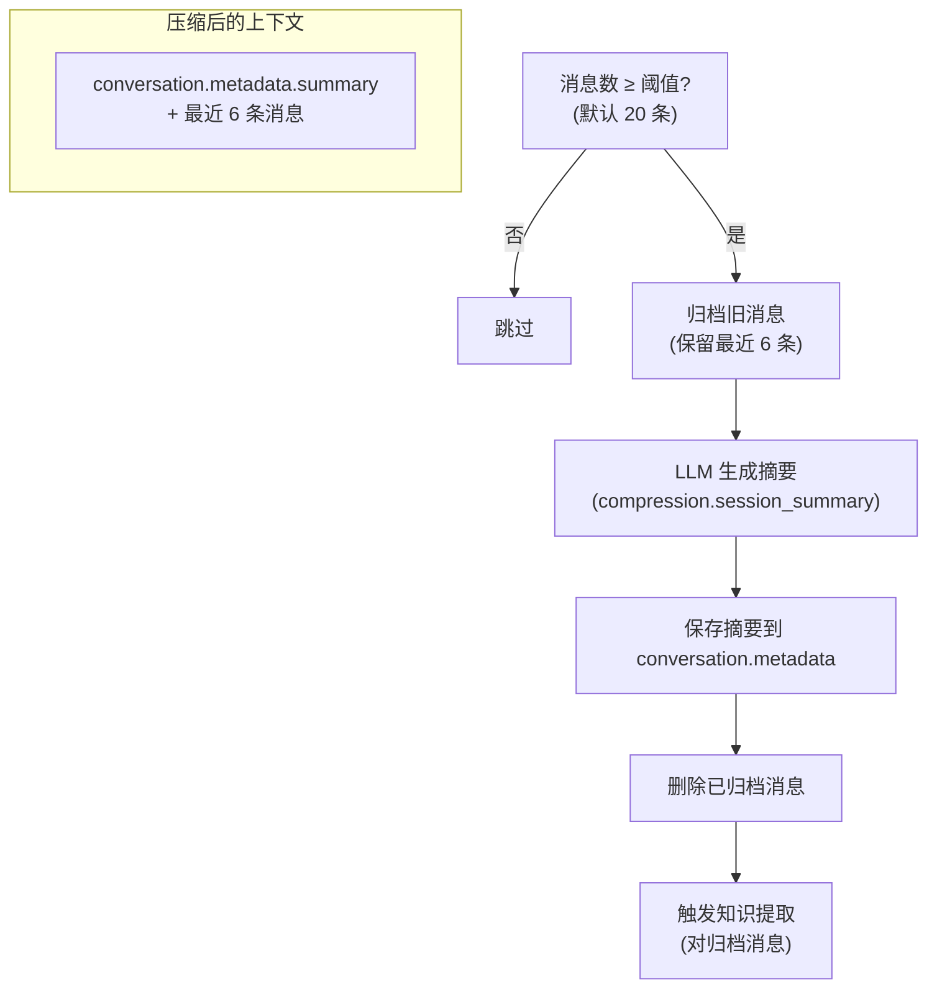

### 6.3 知识活跃度与衰减

```mermaid
graph TB
    subgraph 生命周期
        Create["知识入库<br/>active_count = 0"] --> Active["被检索命中<br/>active_count += 1"]
        Active --> Hot["热门知识<br/>hotness_score 高"]
        Active --> Cold["冷门知识<br/>长期未被检索"]
        Cold -->|"90天未访问"| Stale["标记为 stale"]
    end

    subgraph 评分影响
        Score["检索排序"] --> |"blend_scores()"| Mix["语义 80% + 热度 20%"]
        Mix --> Higher["高频知识排名更高"]
        Mix --> Lower["冷门知识排名下降"]
    end
```

---

## 7. 前端界面

### 7.1 页面功能矩阵

| 页面 | 路径 | 核心功能 |
|------|------|----------|
| **对话** | `/admin/chat` | SSE 流式对话、Timeline 展示（用户/AI/工具调用/错误） |
| **搜索** | `/admin/search` | 语义搜索 + SQL 搜索、L0→L1→L2 渐进展示、相关度分数 |
| **技能管理** | `/admin/skills` | 新建/编辑/删除 Dialog、类型过滤、Markdown 内容预览 |
| **文档管理** | `/admin/documents` | 文件夹管理、批量上传、转换为 Skill |
| **系统设置** | `/admin/settings` | LLM 配置（Provider/Key/URL/Model）、测试连接、保存 |
| **提示词** | `/admin/prompts` | Prompt 模板管理 |
| **快速设置** | `/admin/quick-setup` | 引导式初始化 |

### 7.2 搜索结果渐进展示

```mermaid
flowchart LR
    subgraph 折叠状态
        L0_Card["名称 + 摘要 (L0)<br/>相关度 87% | semantic"]
    end

    subgraph 展开状态
        L1_Section["L1 概览<br/>结构化的知识概要<br/>~500 字"]
        L2_Section["L2 内容预览<br/>完整内容的前 200 字"]
    end

    L0_Card -->|"点击展开"| L1_Section
    L1_Section --> L2_Section
```

---

## 8. 数据模型

### 8.1 核心模型关系

```mermaid
erDiagram
    Skill {
        string id PK
        string uri UK
        string name
        string description
        string type "system/document/user"
        string category "search/prompt/retrieval/tool"
        string abstract "L0"
        string overview "L1"
        string content "L2"
        json trigger_keywords
        json trigger_intents
        boolean is_active
        int priority
        string source_document_id FK
        string folder_id FK
    }

    Document {
        string id PK
        string uri
        string title
        string filename
        string file_path
        string content
        string status "pending/processing/completed/failed"
        string skill_id FK
        boolean is_converted
        string converted_at
    }

    VectorIndex {
        string id PK
        string uri
        string context_type
        int level "0/1/2"
        string text
        string vector_json
        int vector_dim
        json meta
        int active_count
    }

    ContextRelation {
        string id PK
        string source_uri
        string target_uri
        string relation_type "derived_from/merged_from/related_to"
        string reason
    }

    Conversation {
        string id PK
        string title
        json metadata "summary/compressed_at"
    }

    Message {
        string id PK
        string conversation_id FK
        string role "user/assistant/system/tool"
        string content
        json tool_calls
        int latency_ms
    }

    Skill ||--o{ VectorIndex : "uri → 索引"
    Skill }o--|| Document : "source_document_id"
    Skill ||--o{ ContextRelation : "uri → 关联"
    Document }o--|| DocumentFolder : "folder_id"
    Conversation ||--o{ Message : "conversation_id"
```

### 8.2 VectorIndex 索引结构

每个 Skill 在 VectorIndex 中最多有 2 条记录（L0 和 L1），通过 `(uri, level)` 复合唯一键区分：

| uri | level | text | 用途 |
|-----|-------|------|------|
| `sk://skills/python-basics` | 0 | "Python 基础教程的核心概念..." | L0 向量检索 |
| `sk://skills/python-basics` | 1 | "## 功能概述\n..." | L1 Rerank |

---

## 9. 配置体系

### 9.1 配置来源

```mermaid
flowchart LR
    ENV[".env 环境变量"] --> Settings["config.py Settings"]
    DB_CONFIG["system_config 表"] --> SystemConfigService
    Settings --> Runtime["运行时参数"]
    SystemConfigService --> Runtime
```

### 9.2 配置项一览

| 分类 | 配置项 | 默认值 | 说明 |
|------|--------|--------|------|
| **应用** | `APP_NAME` | Skill-Know | 应用名称 |
| **LLM** | `LLM_PROVIDER` | openai | 提供商 |
| | `LLM_API_KEY` | | API 密钥 |
| | `LLM_BASE_URL` | https://api.openai.com/v1 | API 地址 |
| | `LLM_CHAT_MODEL` | gpt-4o-mini | 聊天模型 |
| | `LLM_EMBEDDING_MODEL` | text-embedding-3-small | 嵌入模型 |
| **检索** | `DEFAULT_SEARCH_MODE` | fast | fast / thinking |
| | `DEFAULT_SEARCH_LIMIT` | 5 | 默认检索数量 |
| | `AUTO_GENERATE_L0` | true | 自动生成 L0 摘要 |
| | `AUTO_GENERATE_L1` | true | 自动生成 L1 概览 |
| **生命周期** | `ENABLE_KNOWLEDGE_DECAY` | true | 启用知识衰减 |
| | `KNOWLEDGE_DECAY_DAYS` | 90 | 衰减天数阈值 |
| **Rerank** | `RERANK_ENABLED` | false | 启用 Rerank |
| | `RERANK_MODEL` | | Rerank 模型 |
| | `RERANK_API_KEY` | | Rerank API Key |
| | `RERANK_BASE_URL` | | Rerank API 地址 |
| **会话** | `SESSION_COMPRESS_THRESHOLD` | 20 | 压缩触发消息数 |

---

## 附录：OpenViking 借鉴清单

| OpenViking 模式 | Skill-Know 对应实现 | 阶段 |
|-----------------|---------------------|------|
| Context + URI + L0/L1/L2 | `core/context.py` | Phase 1 |
| ParserRegistry | `parse/registry.py` | Phase 1 |
| SkillProcessor 管线 | `services/skill_processor.py` | Phase 1 |
| VectorStore + Scoring | `core/vector_store.py` + `core/scoring.py` | Phase 1 |
| QueueManager | `core/queue.py` | Phase 1 |
| MemoryDeduplicator | `services/knowledge_deduplicator.py` | Phase 2 |
| IntentAnalyzer (multi-query) | `services/intent_analyzer.py` | Phase 2 |
| HierarchicalRetriever (L0+L1) | `services/retriever.py` | Phase 2 |
| MemoryExtractor | `services/knowledge_extractor.py` | Phase 2 |
| Chat RAG 预检索 | `services/chat.py` _pre_retrieve | Phase 2 |
| 活跃度生命周期 | `VectorStore` + `SkillRetriever` | Phase 2 |
| Prompt 模板注册表 (YAML) | `prompts/manager.py` | Phase 3 |
| Rerank 客户端 (模型级) | `core/rerank.py` | Phase 3 |
| SessionCompressor | `services/session_compressor.py` | Phase 3 |
| 向量 DB 适配层 | `core/vector_backends/` | Phase 3 |
| 集中式 Pydantic 配置 | `core/config.py` Settings | Phase 3 |
